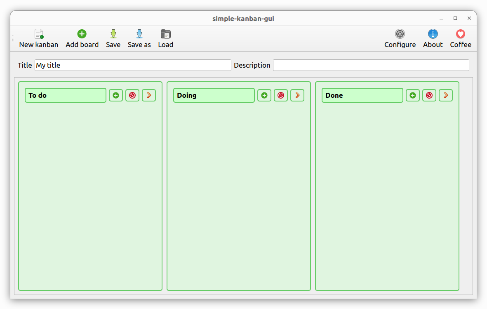

# simple-kanban-gui

A simple kanban graphic user interface



## 1. Installing

To install the package from `PyPI`, follow the instructions below:


```bash
pip install --upgrade simple-kanban-gui
```

Execute `which simple-kanban-gui` to see where it was installed, probably in `/home/USERNAME/.local/bin/simple-kanban-gui`.

### Using

To start, use the command below:

```bash
simple-kanban-gui
```
## 2. More information

If you want more information go to [doc](https://github.com/trucomanx/SimpleKanbanGUI/blob/main/doc) directory.

## 3. Buy me a coffee

If you find this tool useful and would like to support its development, you can buy me a coffee!  
Your donations help keep the project running and improve future updates.  

[☕ Buy me a coffee](https://ko-fi.com/trucomanx) 

## 4. License

This project is licensed under the GPL license. See the `LICENSE` file for more details.
